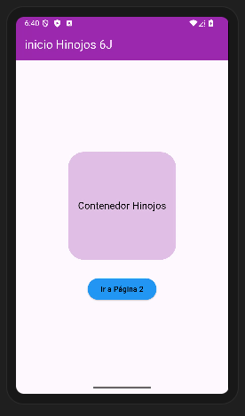
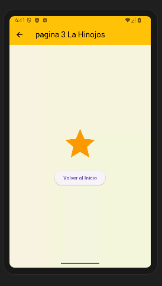

# Nsavegacion entre paginas con Flutter
# Lidia Hinojos Gpo 6J
# Mi prompt o pregunta AI

Lenguaje Dart Flutter, Nivel principiante, navegación entre 3 paginas utilizando rutas nombradas, desde main llamar a la pagina1, en la pagina en appbar mostrar el texto "inicio Hinojos 6J" en color blanco, color de fondo morado, iconos blancos, en body un contenedor redondeado color morado claro de 200 por 200 con texto negro y centrado, y un botón de color azul texto negro para seleccionar pagina 2, en la pagina 2 un appbar con texto "Segunda pagina 6J en color rosa, con fondo negro y los iconos en blanco, en body una imagen desde la red y un botón para avanzar a la pagina 3, en la pagina 3 en appbar un texto color negro "pagina 3 La Hinojos", color de fondo beige, todo en un solo archivo, elegante y atractivo

## pantallas en web

## pantallas en android

